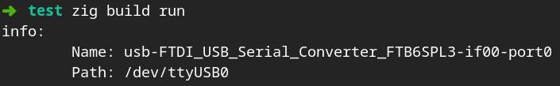

# serialport



Cross-platform serial port library, with convenient poll/read/write interface.
Kept up to date to work with latest Zig master branch.

## Todo

- [ ] Support flow control status check
- [ ] Offer both blocking and non-blocking reads/writes
- [ ] Port descriptions and information
- [ ] Export C library

## Examples

### Port Iteration

```zig
// ...
var it = try serialport.iterate();
defer it.deinit();

while (try it.next()) |stub| {
  // Stub name used only to identify port, not to open it.
  std.log.info("Found COM port {s}", .{stub.name});

  std.log.info("Port file path: {s}", .{stub.path});
}
// ...
```

### Polling Reads

```zig
// ...
var port = try serialport.open(my_port_path, .{ .mode = .read_write });
// Typical serial port use cases will often want exclusive lock of the port.
// Use `lock_nonblocking` field to immediately return an open failure if the
// port is currently being used, rather than blocking and waiting to open.
port = try serialport.open(my_port_path, .{
  .mode = .read_write,
  .lock = .exclusive,
  .lock_nonblocking = true,
});
defer port.close();

try port.configure(.{
  .baud_rate = .B115200,
});

// Increase buffer size >1 to make a buffered reader.
var reader_buffer: [1]u8 = undefined;
var reader = port.reader(&reader_buffer);

var result_buffer: [128]u8 = undefined;
const timeout = 1_000 * std.time.ns_per_ms;

var timer = try std.time.Timer.start();
// Keep polling and reading until no bytes arrive for 1000ms.
while (timer.read() < timeout) {
  if (try port.poll()) {
    const read_size = try reader.interface.readSliceShort(&result_buffer);
    std.log.info("Port bytes arrived: {any}", .{result_buffer[0..read_size]});
    timer.reset();
  }
}
// ...
```
